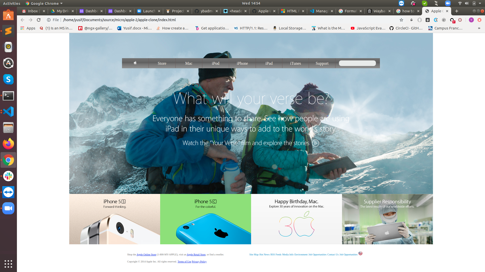

# Building with Backgrounds and Gradients - Apple.com

A clone of an old Apple website written in HTML and using CSS for styling.

The purpose of this project is to apply the learned topics about CSS3 basics, box model, floats, positioning, flexbox, grid, backgrounds and, gradients.

The real webpage can be found here - (https://web.archive.org/web/20140301004610/http://www.apple.com/).

## Built With

- Visual Studio Code
- HTML
- CSS
- Git, GitHub

## Live Demo

[Live Demo Link](https://ybadmus.github.io/apple-clone/)

## Getting Started

To get a local copy up and running follow these simple steps.
- Clone the project unto your local machine
- Open up the `.html` file.

### Prerequisites

Before you continue, be sure that you have installed:

- A Git GUI.
- An Integrated Development Environment.
- Chrome, Firefox or Opera. Internet Explorer is not supported.

## Authors

👤 **Author1**

- Github: [@ybadmus](https://github.com/ybadmus)
- Twitter: [@ybadmus](https://twitter.com/ybadmus)
- Linkedin: [ybadmus](https://linkedin.com/ybadmus)

## 🤝 Contributing

Contributions, issues and feature requests are welcome!

Feel free to check the [issues page](https://github.com/ybadmus/apple-clone/issues).

### Steps

1. Fork this repository.

2. Create a branch: git checkout -b <branch_name>.

3. Make your changes and commit them: git commit -m '<commit_message>'

4. Push to the original branch: git push origin <project_name>/

5. Create the pull request.

Alternatively see the GitHub documentation on creating a pull request. Feel free to check the issues page.

## Show your support

Give a ⭐️ if you like this project!

## Acknowledgments

- Shout out to all my Stand Up team members for the contribution.

## 📝 License

This project is [MIT](lic.url) licensed.

## Enjoy!